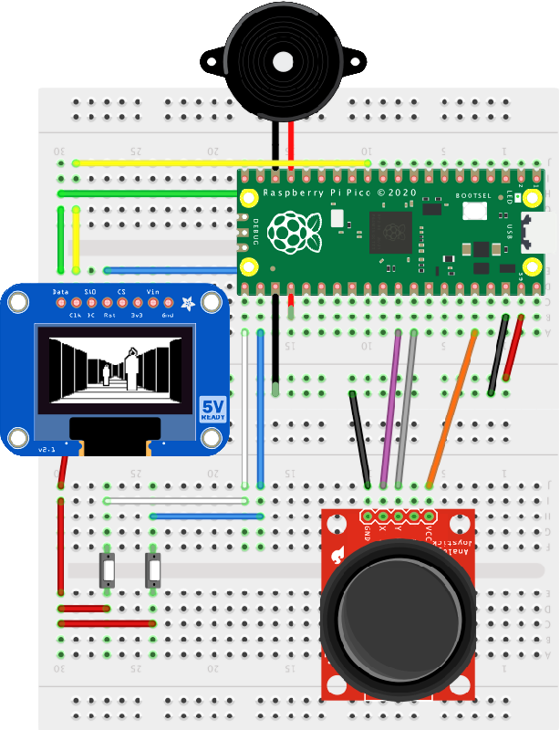
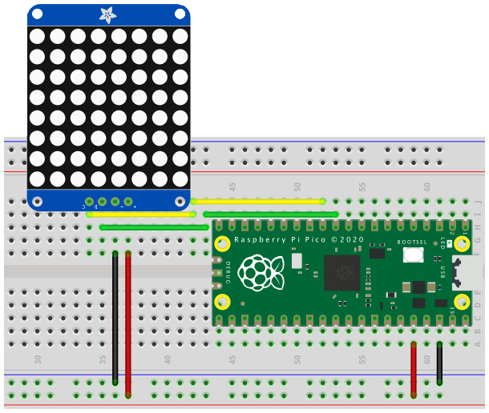

# pi-pico

Assorted projects made while playing with the [Raspberry Pi Pico](https://www.raspberrypi.org/documentation/pico/getting-started/).

## Phantom Slayer 1.0.2 ##

A retro-style 3D arcade game written in C. For more details, [see this page](https://smittytone.net/pico-phantoms/).

### Requirements ###

* An SSD1306-based 128x64 OLED display; I used [this display](https://www.adafruit.com/product/326).
* A piezo speaker.
* Two small buttons.
* A two-way, self-centring analog joystick; there are [lots available on eBay](https://www.ebay.co.uk/itm/New-PSP-2-Axis-Analog-Thumb-GAME-Joystick-Module-3V-5V-For-arduino-PSP/401104248437?hash=item5d63ad1e75:g:HcEAAOSwjqVZNSzw).
* Wires.
* Two standard breadboards.

### Build ###



* The joystick shown is not the one used, but it gives you the idea. Connect purple to the X pin, white to the Y pin.

### The Code ###

Build from source code, or copy `phantoms.uf2` to your Pico. Please check the SHA 256:

```
d9e4e2d28b8a5b983e1551d114cd4ae6d668858b43a9df6c92f946327a96f146
```

### The Game ###

See [this blog post for full details](https://blog.smittytone.net/2021/03/26/3d-arcade-action-courtesy-of-raspberry-pi-pico/).

### Credits ###

This games is based on a 1982 original created by Ken Kalish of Med Systems for the Tandy Color Computer. The design is Ken’s; the code is mine, and I’ve taken only a few liberties with certain details.

Phantom Slayer uses [TinyMT](https://github.com/MersenneTwister-Lab/TinyMT), copyright © 2011 Mutsuo Saito, Makoto Matsumoto, Hiroshima University and The University of Tokyo. All rights reserved. Licensed under the [three-clause BSD Licence](/phantoms/TinyMT-Licence.txt).

## Hunt the Wumpus 1.0.2 ##

A sample C project to build a fun game.

### Requirements ###

* An HT16K33-based 8x8 LED matrix; I used [this display](https://www.adafruit.com/product/1049).
* A piezo speaker.
* One small button.
* A two-way, self-centring analog joystick; there are [lots available on eBay](https://www.ebay.co.uk/itm/New-PSP-2-Axis-Analog-Thumb-GAME-Joystick-Module-3V-5V-For-arduino-PSP/401104248437?hash=item5d63ad1e75:g:HcEAAOSwjqVZNSzw).
* A red LED.
* A green LED.
* Wires.
* Two standard breadboards.

### Build ###


* Make sure you wire the LEDs correctly: longer leg to the Pico pin, shorter leg to GND.
* The joystick shown is not the one used, but it gives you the idea. Connect white to the X pin, blue to the Y pin.

### The Code ###

Build from source code, or copy `wumpus.uf2` to your Pico. Please check the SHA 256:

```
65957c643df25f89ddd3f70f16131c7037e582fa04743c35b7af78b90eb0a0f5
```

### The Game ###

This is a fun little game to hunt the Wumpus. Move through the cave with the joystick.

A red light indicates a nearby pit — if you fall in, you’ll be killed.

A twittering sound indicates a nearby bat. If you enter its square, it will carry you to another part of the cave.

A green light indicates the Wumpus is close. Enter its square and it will eat you, but if you’re sure where it is, press the button to fire an arrow to kill it first. To fire the arrow successfully, back off and then move toward the Wumpus in the direction you want to the arrow to fly. If you miss, the beast will catch you!

### Credit ###

This version was based on an [Arduino version](https://github.com/coreyfaure/HuntTheWumpus-Arduino) created by Corey Faure. This is very much his game, but I have taken a few liberties with a couple of the animations and rewritten the code.

Hunt the Wumpus uses [TinyMT](https://github.com/MersenneTwister-Lab/TinyMT), copyright © 2011 Mutsuo Saito, Makoto Matsumoto, Hiroshima University and The University of Tokyo. All rights reserved. Licensed under the [three-clause BSD Licence](/wumpus/TinyMT-Licence.txt).

## sensor ##

A sample C project. Requires an HT16K33-based 4-digit, 7-segment LED and an SGP30 TVOC sensor. I used [this sensor](https://shop.pimoroni.com/products/sgp30-air-quality-sensor-breakout) and [this display](https://www.adafruit.com/product/878):


## i2c ##

A sample C project. Requires an HT16K33-based 8x8 LED matrix. I used [this display](https://www.adafruit.com/product/1049).



## micropython ##

A sample MicroPython project. Requires an HT16K33-based 8x8 LED matrix.

## makepico

Pico project set up script for Z Shell. Requires Pico C SDK pre-installed.

## Updates ##

- *6 April 2021*
    - Bump Phantom Slayer to 1.0.2
        - Move some common routines into `utils.h`/`utils.c`.
        - Update *inkey()* to return the key pressed.
        - Add another map.
- *31 March 2021*
    - Bump Phantom Slayer to 1.0.1
        - Graphics tweaks.
        - Improve Phantom movement logic.
        - Fix laser post-fire delay.
    - Bump Hunt the Wumpus to 1.0.2
        - Use TinyMT for random number generation.
    - Bump makepico to 1.2.0.
- *26 March 2021*
    - Add Phantom Slayer 1.0.0
- *25 February 2021*
    - Bump Wumpus to 1.0.1
        - Tweak sprites.
        - Improve trophy presentation.
        - Improve in-game code flow.
- *20 February 2021*
    - Add *wumpus* example.
    - Update *makepico* script:
        - Add VSCode config creation.
        - Add `-d`/`--debug` switch to add VSCode SWD debugging support.
- *5 February 2021*
    - Add *sensor* example.
- *4 February 2021*
    - Add debugger-friendly VSCode `launch.json`.
- *2 February 2021*
    - Initial release.

Released under the MIT Licence. Copyright © 2021, Tony Smith (@smittytone).