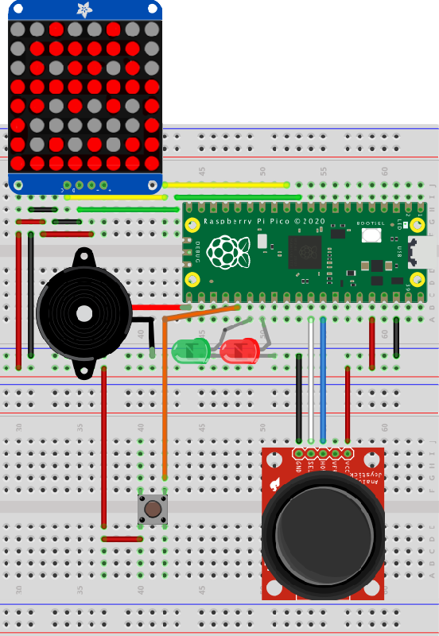
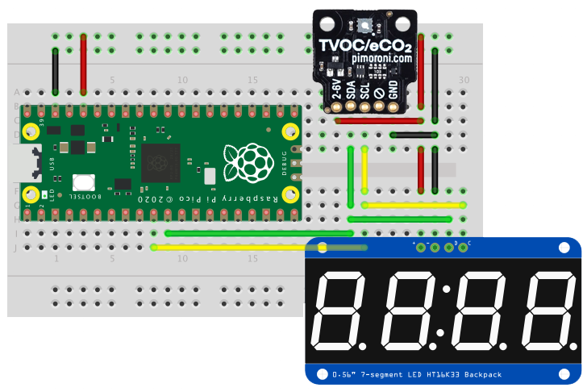

# pi-pico

Assorted projects made while playing with the [Raspberry Pi Pico](https://www.raspberrypi.org/documentation/pico/getting-started/).

## Wumpus ##

A sample C project to build a fun game.

### Requirements ###

* An HT16K33-based 8x8 LED matrix; I used [this display](https://www.adafruit.com/product/1049)
* A piezo speaker
* One small button
* A two-way, self-centring analog joystick; there are [lots available on eBay](https://www.ebay.co.uk/itm/New-PSP-2-Axis-Analog-Thumb-GAME-Joystick-Module-3V-5V-For-arduino-PSP/401104248437?hash=item5d63ad1e75:g:HcEAAOSwjqVZNSzw)
* A red LED
* A green LED
* Wires

### Build ###

* Make sure you wire the LEDs correctly: longer leg to the Pico pin, shorter leg to GND.
* The joystick shown is not the one used, but it gives you the idea. Connect white to the X pin, blue to the Y pin.

### The Game ###

This is a fun little game to hunt the Wumpus. Move through the cave with the joystick.

A red light indicates a nearby pit — if you fall in, you’ll be killed.

A twittering sound indicates a nearby bat. If you enter its square, it will carry you to another part of the cave.

A green light indicates the Wumpus is close. Enter its square and it will eat you, but if you’re sure where it is, press the button to fire an arrow to kill it first. To fire the arrow successfully, back off and then move toward the Wumpus in the direction you want to the arrow to fly. If you miss, the beast will catch you!

### Credit ###

This version was based on an [Ardiuno version](https://github.com/coreyfaure/HuntTheWumpus-Arduino) created by Corey Faure. This is very much his game, but I have taken a few liberties with a couple of the animations and rewritten the code.

## i2c ##

A sample C project. Requires an HT16K33-based 8x8 LED matrix. I used [this display](https://www.adafruit.com/product/1049).

## sensor ##

A sample C project. Requires an HT16K33-based 4-digit, 7-segment LED and an SGP30 TVOC sensor. I used [this sensor](https://shop.pimoroni.com/products/sgp30-air-quality-sensor-breakout) and [this display](https://www.adafruit.com/product/878):

## micropython ##

A sample MicroPython project. Requires an HT16K33-based 8x8 LED matrix.

## makepico ##

Pico project set up script for Z Shell. Requires Pico C SDK pre-installed.

## Updates ##

- *Unreleased*
    - Add *wumpus* example.
    - Update *makepico* script:
        - Add VSCode config creation.
        - Add `-d`/`--debug` switch to add VSCode SWD debugging support.
- *5 February 2021*
    - Add *sensor* example.
- *4 February 2021*
    - Add debugger-friendly VSCode `launch.json`.
- *2 February 2021*
    - Initial release.

Released under the MIT Licence. Copyright © 2021, Tony Smith (@smittytone).