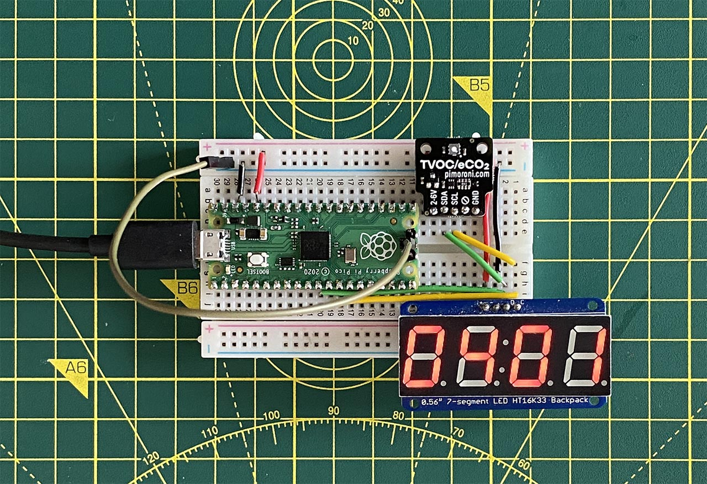

# pi-pico

Assorted projects made while playing with the [Raspberry Pi Pico](https://www.raspberrypi.org/documentation/pico/getting-started/).

* **i2c** — Sample C project. Requires an HT16K33-based 8x8 LED matrix. I used [this display](https://www.adafruit.com/product/1049).
* **sensor** — Sample C project. Requires an HT16K33-based 4-digit, 7-segment LED and an SGP30 TVOC sensor. I used [this sensor](https://shop.pimoroni.com/products/sgp30-air-quality-sensor-breakout) and [this display](https://www.adafruit.com/product/878). 
* **micropython** — Sample MicroPython project. Requires an HT16K33-based 8x8 LED matrix.
* **makepico** — Pico project set up script for Z Shell. Requires Pico C SDK pre-installed.

## Updates ##

- *5 February 2021*
    - Add *sensor* example.
- *4 February 2021*
    - Add debugger-friendly VSCode `launch.json`.
- *2 February 2021*
    - Initial release.

Released under the MIT Licence. Copyright © 2021, Tony Smith (@smittytone).